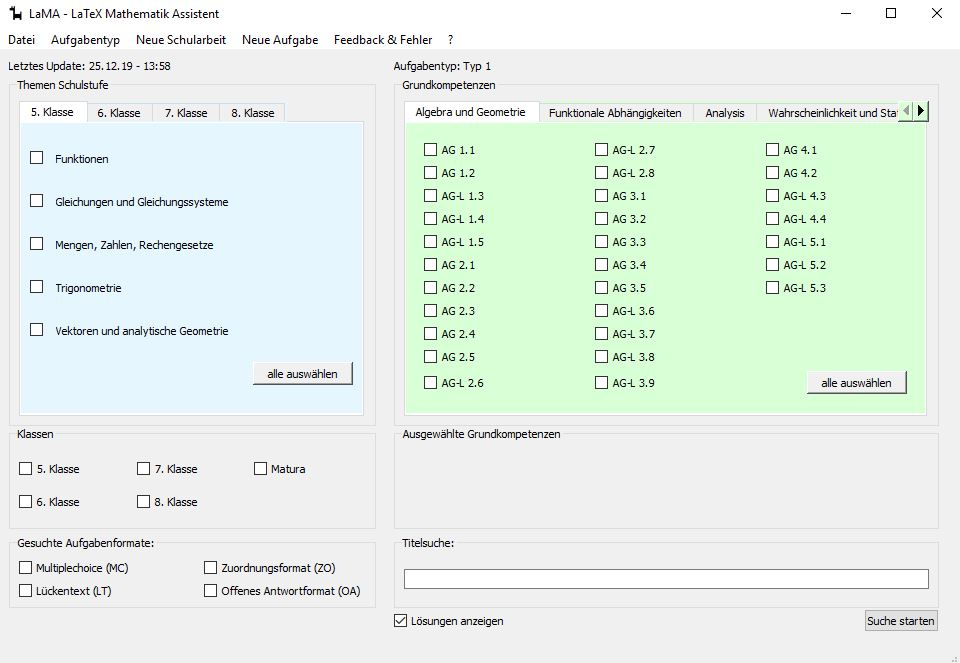
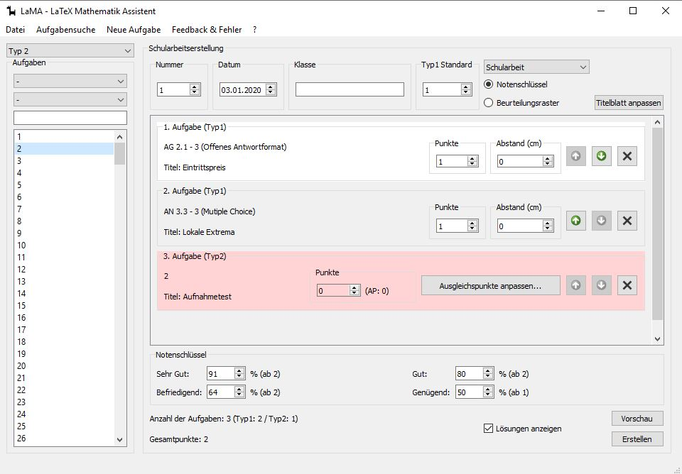
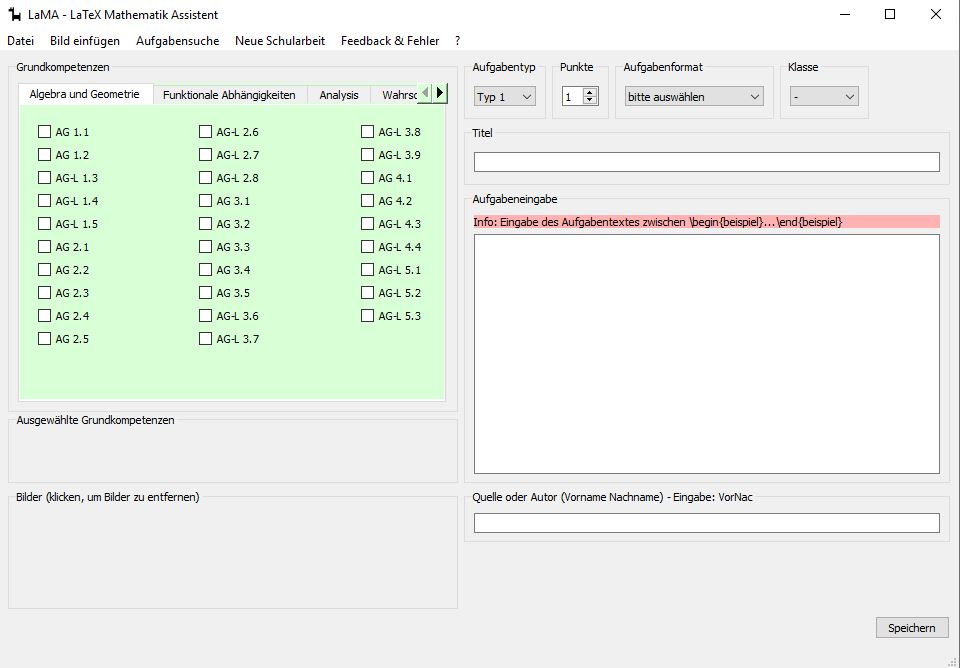

# LaMA -- LaTeX Mathematics Assistent
## Dependencies
- Python3
- PyQt5
- PyYaml
- Pillow
- LaTeX
- LaTeX-package: srdp-mathematik <https://ctan.org/pkg/srdp-mathematik>

## German Version
### Beschreibung

LaMA ist ein Programm, dass Ihnen erlaubt aus einem Pool von Aufgaben eine Schularbeit zusammenzustellen.
Die Aufgaben sind getrennt nach Typ1 und Typ2 in Schulstufen und Kompetenzen sortiert.
Es besteht auch die Möglichkeit eigene Aufgaben zu erstellen und dem Pool zuzuführen.
Nähere Infos unter: lama.schule.at

### Maintainers and Contributes
Maintainer:
- chrisiweb

Contributes:
- dfessor (linux compatibility et al.)

## English Version

LaMA is a program that lets you create and choose mathematical problems for your class.
The problems are organized in competences and levels you can choose from.
Further infos: lama.schule.at

## Screenshots

<!--
## To Do
- How to install
- What the project does
- Why the project is useful
- How users can get started with the project
- Where users can get help with your project
- Who maintains and contributes to the project
-->
