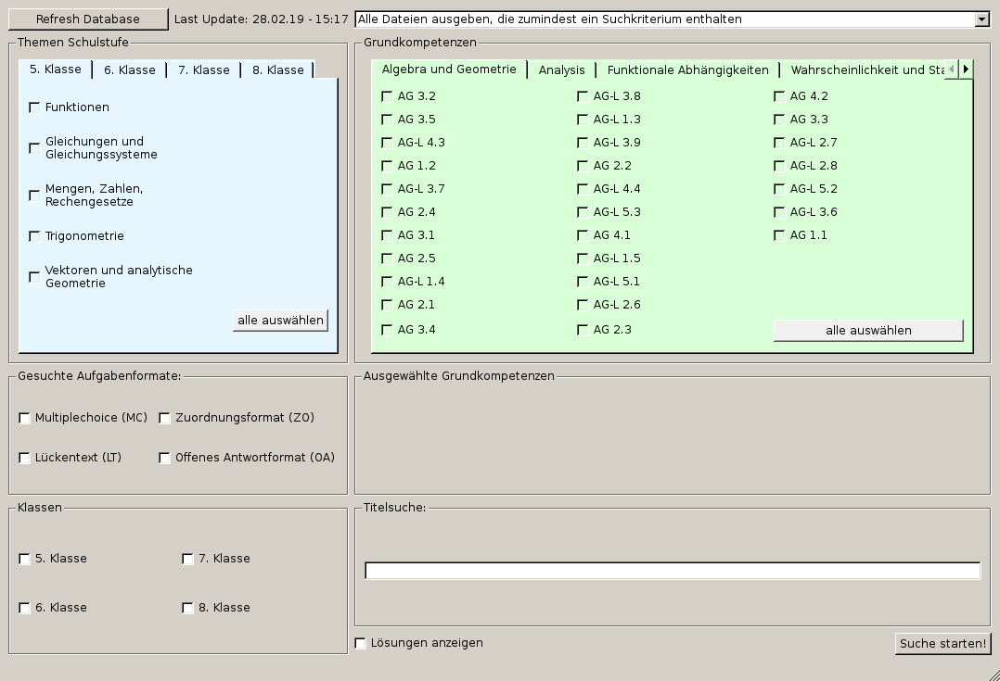

# Parhamer_connection
## Dependencies
- Python3
- PyQt4
- PyYaml

## German Version

Parhamer_connection ist ein Programm, das in Python geschrieben wurde.
Es besteht aus einem UI in QT4, dass eine Ordnerhierachie durchsucht.
Die Ordner enthalten mathematische Aufgaben, welche in LaTeX geschrieben wurden.
So können leicht Tests oder Schularbeiten erstellt werden.

Das Programm funktioniert mit dem Latex-Projekt srdp-mathematik (auf C-Tan zu finden).
Link: [https://ctan.org/pkg/srdp-mathematik](https://ctan.org/pkg/srdp-mathematik)

### Screenshot

### Maintainers and Contributers
Maintainer:
- chrisiweb

Contributers:
- dfessor

## English Version

## To Do
- What the project does
- Why the project is useful
- How users can get started with the project
- Where users can get help with your project
- Who maintains and contributes to the project
